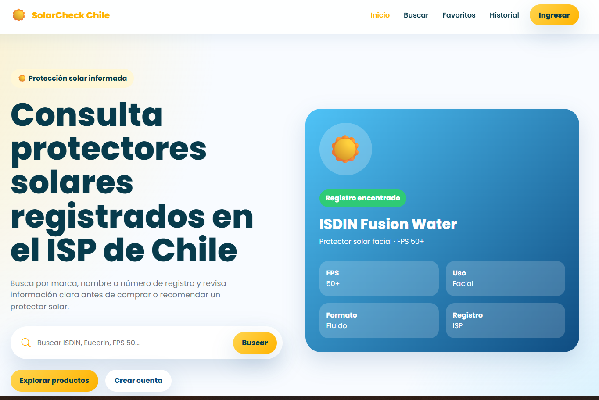
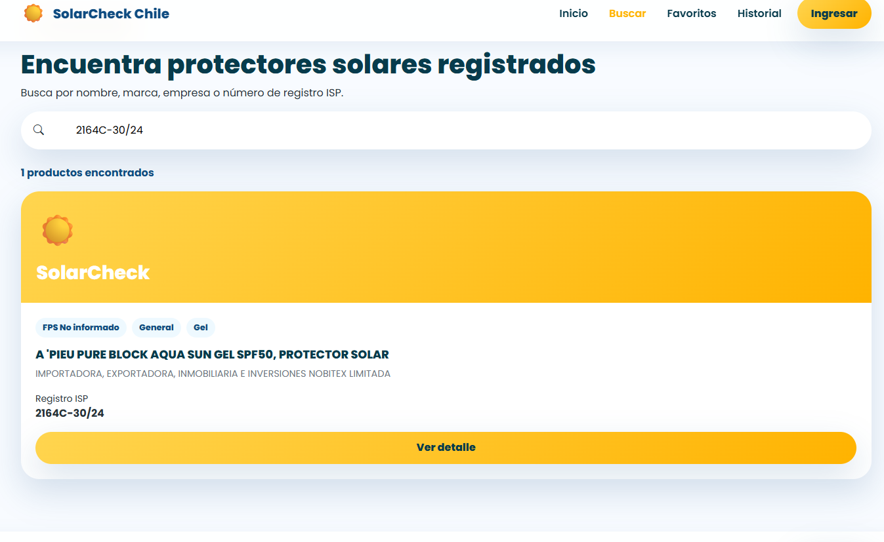
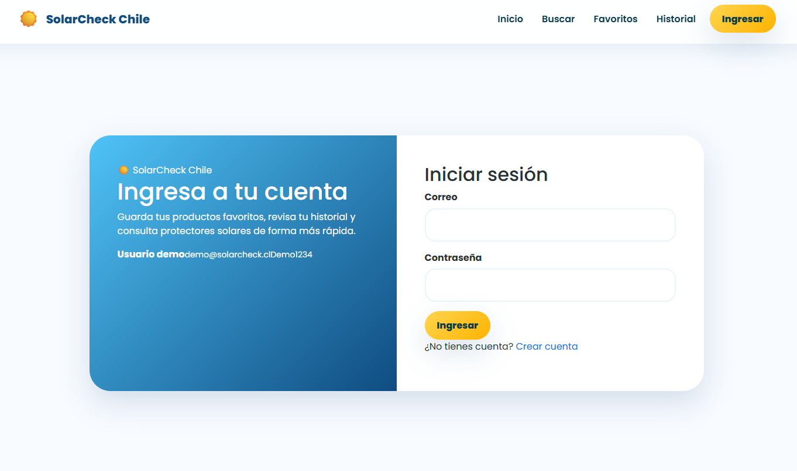

# ☀️ SolarCheck Chile


Aplicación web desarrollada con **Vue 3** para consultar protectores solares registrados en el **Instituto de Salud Pública de Chile (ISP)**, permitiendo buscar productos por nombre, empresa o registro sanitario mediante una interfaz moderna, responsive y fácil de utilizar.

---

# 📑 Índice

- [☀️ Descripción](#-descripción)
- [🌐 Demo](#-demo)
- [📂 Repositorio](#-repositorio)
- [✨ Características principales](#-características-principales)
- [📸 Capturas](#-capturas)
- [👤 Usuario Demo](#-usuario-demo)
- [🔎 Registros ISP para probar](#-registros-isp-para-probar)
- [🛠 Tecnologías utilizadas](#-tecnologías-utilizadas)
- [📁 Estructura del proyecto](#-estructura-del-proyecto)
- [🚀 Instalación](#-instalación)
- [📊 Fuente de datos](#-fuente-de-datos)
- [🚀 Próximas mejoras](#-próximas-mejoras)
- [👩‍💻 Autora](#-autora)
- [⭐ Apoya este proyecto](#-apoya-este-proyecto)

---

# ☀️ Descripción

SolarCheck Chile facilita la consulta de protectores solares registrados en el ISP de Chile.

La aplicación organiza la información de manera clara y permite localizar rápidamente productos mediante diferentes criterios de búsqueda, ofreciendo una experiencia simple tanto para usuarios generales como para quienes desean verificar un registro sanitario.

---

# 🌐 Demo

🔗 https://solarcheck-chile.vercel.app/

---

# 📂 Repositorio

🔗 https://github.com/Paula-front/solarcheck-chile

---

# ✨ Características principales

- Consulta de protectores solares registrados en el ISP.
- Búsqueda por:
  - Nombre del producto.
  - Marca.
  - Empresa.
  - Registro sanitario ISP.
- Vista detallada del producto.
- Identificación automática de:
  - Marca.
  - FPS.
  - Tipo de uso.
  - Formato.
- Registro de usuarios.
- Inicio de sesión.
- Usuario Demo.
- Perfil de usuario.
- Diseño Responsive.
- Persistencia de sesión mediante LocalStorage.

---

# 📸 Capturas

## 🏠 Inicio



---

## 🔍 Búsqueda de productos



---

## 🔐 Inicio de sesión



---

# 👤 Usuario Demo

Para facilitar la revisión del proyecto se incluye un usuario de prueba.

**Correo**

```text
demo@solarcheck.cl
```

**Contraseña**

```text
Demo1234
```

---

# 🔎 Registros ISP para probar

Puedes buscar cualquiera de los siguientes registros sanitarios:

| Registro ISP | Producto |
|--------------|----------|
| **187C-4454/21** | AVON CARE SUN+ KIDS FPS 50 |
| **3513C-32/26** | Bamboo 365 Super Aqua Sunscreen SPF 50+ |
| **1963C-281/26** | Celimax Oil Control Mattifying Sun Stick FPS 50+ |

También puedes realizar búsquedas utilizando:

- ISDIN
- AVON
- Bamboo
- Celimax

---

# 🛠 Tecnologías utilizadas

- Vue 3
- Vue Router
- Pinia
- Vite
- JavaScript (ES6+)
- Bootstrap 5
- Bootstrap Icons
- SASS
- LocalStorage
- JSON

---

# 📁 Estructura del proyecto

```text
src
│
├── assets
├── components
├── composables
├── data
├── router
├── services
├── stores
├── utils
└── views
```

---

# 🚀 Instalación

Clonar el repositorio

```bash
git clone https://github.com/Paula-front/solarcheck-chile.git
```

Ingresar al proyecto

```bash
cd solarcheck-chile
```

Instalar dependencias

```bash
npm install
```

Ejecutar en modo desarrollo

```bash
npm run dev
```

Compilar para producción

```bash
npm run build
```

---

# 📊 Fuente de datos

La información utilizada corresponde a registros públicos del **Instituto de Salud Pública de Chile (ISP)**.

Los datos fueron adaptados y estructurados en formato **JSON** exclusivamente con fines educativos para facilitar la consulta desde la aplicación.

---

# 🚀 Próximas mejoras

- ⭐ Sistema de favoritos.
- 📜 Historial de consultas.
- ❤️ Comparador de productos.
- 🔎 Filtros avanzados.
- ☁️ Sincronización con futuras actualizaciones del ISP.

---

# 👩‍💻 Autora

**Paula Pérez Valenzuela**

Proyecto desarrollado para el **Módulo 8 – Portafolio de Productos** del curso **Desarrollo de Aplicaciones Front-End Trainee**.

---

# ⭐ Apoya este proyecto

Si este proyecto te resultó útil o interesante, considera dejar una **⭐ en el repositorio**. ¡Ayuda a que más personas puedan descubrirlo!